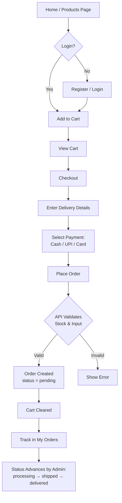
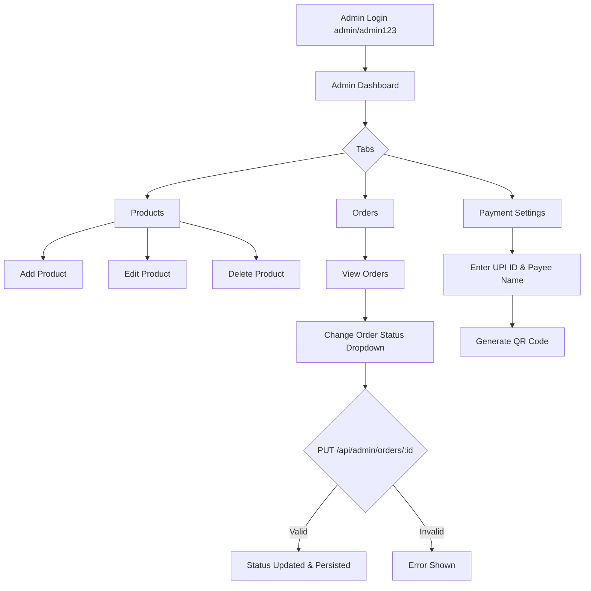
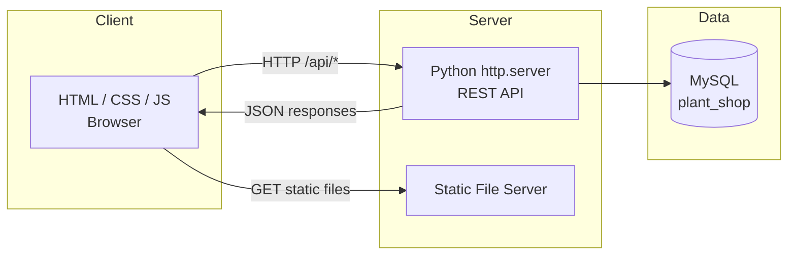

# 3. Supporting Materials

## 3.1 App / Website Prototypes

GreenLeaf Plants is a **responsive web application** with the following screen prototypes:

| Screen | File | Purpose |
|--------|------|---------|
| **Home** | `index.html` | Hero banner, featured products. |
| **Products Listing** | `products.html` | Search bar, filters, product grid. |
| **Product Detail** | `product.html` | Full product info, quantity selector, Add to Cart. |
| **Cart** | `cart.html` | Cart items, quantity editing, subtotal. |
| **Checkout** | `checkout.html` | Delivery details, payment method, order summary. |
| **My Orders** | `orders.html` | Order history with status progress tracker. |
| **Login** | `login.html` | Customer login form. |
| **Register** | `register.html` | Customer account creation. |
| **Admin Dashboard** | `admin.html` | Product CRUD, order management, UPI settings. |

### 3.1.1 Prototype Layout: Product Card (used on Home & Products pages)

```
+------------------------------------------+
| [ Product Image ]  (180px high, cover)    |
+------------------------------------------+
| [indoor]  [Product Name]                  |
|  ₹ 12.99                                 |
|  Short description text...                |
|  [Add to Cart]  [View]                    |
+------------------------------------------+
```

### 3.1.2 Prototype Layout: Checkout Page

```
+------------------------------------------------+  +-----------------+
| Delivery Details                               |  | Order Summary   |
|  Full Name *                                   |  |  Item x 2  ₹..  |
|  Phone *                                       |  |  Item x 1  ₹..  |
|  Email                                         |  |  ------------   |
|  Delivery Address *                            |  |  Total: ₹..     |
+------------------------------------------------+  +-----------------+
| Payment Method                                  |
|  ( ) Cash on Delivery                          |
|  ( ) UPI  [QR code shown]                      |
|  ( ) Card  [card fields shown]                 |
+------------------------------------------------+
|            [ Place Order ]                     |
+------------------------------------------------+
```

---

## 3.2 Workflow Diagrams

### 3.2.1 Customer Purchase Workflow



### 3.2.2 Admin Order Management Workflow



### 3.2.3 System Architecture (Data Flow Context)



---

## 3.3 System Workflow Explanation

1. **Browsing (Guest):** A guest visits the Home or Products page. The client calls `GET /api/products` with optional filter parameters (`search`, `category`, `plant_type`, `min_price`, `max_price`). The Python server builds a parameterized SQL query, fetches results from MySQL, and returns them as JSON. The frontend renders product cards.

2. **Authentication:** To add to cart or place an order, the user must log in. Registration (`POST /api/auth/register`) validates input, hashes the password with SHA-256, and stores the user. Login (`POST /api/auth/login`) verifies credentials and returns a token (Base64 of `email:password`). The token is stored in `localStorage`.

3. **Adding to Cart:** When a logged-in user clicks "Add to Cart", the product is added to a `localStorage`-based cart. No server call is made for the cart itself — the cart is stored client-side.

4. **Checkout & Order Placement:** During checkout, the frontend collects delivery details and payment method. `POST /api/orders` (with the auth token) validates stock for each item, computes the total, creates the order with `order_status = 'pending'`, inserts order items, decrements stock, and returns the order ID.

5. **Order Tracking:** The customer opens **My Orders**, which calls `GET /api/orders`. The server returns only the authenticated user's orders along with aggregated item strings. The frontend renders a status badge and a progress tracker.

6. **Order Status Updates (Admin):** The admin views all orders via `GET /api/admin/orders`. Changing the status dropdown triggers `PUT /api/admin/orders/:id` with the new status, which updates MySQL and refreshes the view.

7. **Product Management (Admin):** The admin can add, edit, or delete products via the Products tab, which calls the corresponding `POST/PUT/DELETE /api/admin/products` endpoints.

---

## 3.4 Training Module Outlines

Two training modules are defined for end users of the system.

### 3.4.1 Customer Training Module (15 minutes)

| Module | Content |
|--------|---------|
| 1. Introduction | What GreenLeaf Plants offers, how to open the site. |
| 2. Browsing & Searching | Using search bar, category/type/price filters, product detail. |
| 3. Creating an Account | Registering with name, email, phone, password. |
| 4. Logging In | Login flow and session persistence (localStorage). |
| 5. Shopping Cart | Adding items, updating quantity, removing items. |
| 6. Checkout & Payment | Entering delivery details; choosing Cash, UPI, or Card. |
| 7. Tracking Orders | Using the My Orders page and progress tracker. |
| 8. Troubleshooting | Common issues (login required, empty cart, stock). |

### 3.4.2 Admin Training Module (20 minutes)

| Module | Content |
|--------|---------|
| 1. Admin Login | Accessing `admin.html`, credentials `admin` / `admin123`. |
| 2. Dashboard Overview | The three tabs: Products, Orders, Payment Settings. |
| 3. Product Management | Adding, editing, deleting products; setting price/stock/image. |
| 4. Order Management | Viewing orders, reading payment status, updating order status. |
| 5. Payment Settings | Configuring UPI ID and payee name; generating the QR code. |
| 6. Security & Best Practices | Keeping admin credentials safe, understanding stock management. |

---

## 3.5 Prototype / Interface Description

### 3.5.1 Header (All Customer Pages)

A sticky green header contains the **logo**, navigation links (**Home, Indoor, Outdoor, All Plants, My Orders**), a **cart icon with a live item-count badge**, and an **auth section** showing either "Login / Register" or the logged-in user's name with a Logout button.

### 3.5.2 Home Page

- A full-width **hero banner** with the tagline *"Bring Nature Home"* and a "Shop All Plants" button.
- A **Featured At a Glance** section showing the first four products from the API.

### 3.5.3 Products Page

- A **filters bar** with a search input, category dropdown, plant-type dropdown, and min/max price inputs.
- A **product grid** of responsive cards.
- A **result count** showing the number of matching products.

### 3.5.4 Product Detail Page

- A large product image.
- A category badge, plant-type badge, and a **stock indicator** (In Stock / Low Stock / Out of Stock).
- Price, description, a **quantity selector** (+/−), and Add to Cart button.

### 3.5.5 Cart Page

- A list of cart items with thumbnails, names, prices, quantity inputs, and remove buttons.
- A **summary panel** showing item count, subtotal, and total, with a "Proceed to Checkout" button.

### 3.5.6 Checkout Page

- **Delivery Details** form (name, phone, email, address) with validation.
- **Payment Method** selector (Cash / UPI / Card) that reveals the UPI QR code or card fields.
- **Order Summary** listing items and the total.
- A "Place Order" button that submits and shows a success message with a "Track My Order" link.

### 3.5.7 My Orders Page

- Order cards each showing the order number, date, status badge, itemized products, total, payment method, and a **progress tracker** (pending → processing → shipped → delivered).

### 3.5.8 Admin Dashboard

- An **admin login** screen.
- A **tabs panel** with Products, Orders, and Payment Settings.
- Products tab: table with image, name, category, type, price, stock, and Edit/Delete actions; an "Add New Product" button opens a modal.
- Orders tab: table with order ID, customer, phone, items, total, method, payment status, an **inline status dropdown**, and date.
- Payment Settings tab: inputs for UPI ID and payee name, with a "Save & Generate QR" button and a live QR preview.

---

## 3.6 Advantage of Workflow Design

The workflow design of GreenLeaf Plants offers several advantages:

1. **Low-Code, Low-Dependency Architecture** — Using pure Python, MySQL, and vanilla JS means the system is easy to understand, deploy, and run without complex build pipelines or heavy frameworks.

2. **Separation of Concerns** — The REST API, static frontend, and database are clearly separated, making the system modular and maintainable.

3. **Client-Side Cart for Instant Feedback** — Storing the cart in `localStorage` provides an immediate, responsive user experience without network round-trips for every cart action.

4. **Security by Design** — Parameterized SQL, hashed passwords, token-based auth, and path-traversal protection are built into the core workflow.

5. **Clear Role-Based Access** — The public browsing experience, logged-in customer experience, and admin management are clearly delineated, ensuring appropriate access control.

6. **Trackable Fulfilment Pipeline** — A well-defined order status pipeline (pending → processing → shipped → delivered) gives both customers and admins transparency over the order journey.

7. **Configurable Payments** — Admins can update the UPI QR code without code changes, making payment configuration flexible and business-friendly.

8. **Scalable Foundation** — The connection-pooling pattern and modular API design allow the system to be scaled or migrated to a production framework later with minimal rework.
