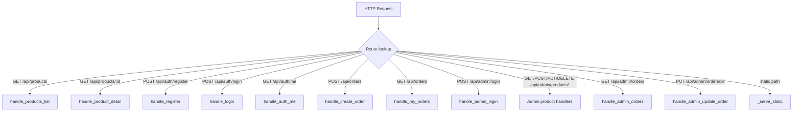
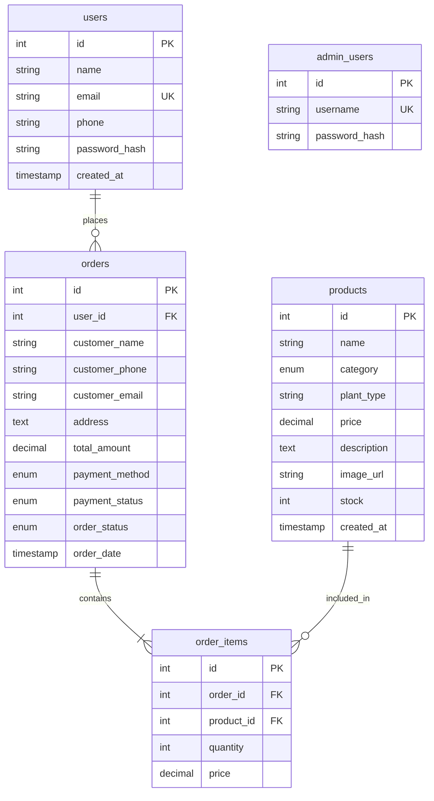

# 6. System Analysis and Design

## 6.1 Requirement Analysis

### 6.1.1 Functional Requirements

The functional requirements are derived from the survey findings, field visit, and problem statement. They are categorized by actor.

#### Customer (Guest + Registered)

| ID | Requirement |
|----|-------------|
| FR-01 | The system shall allow guests to browse the plant catalogue without logging in. |
| FR-02 | The system shall allow users to search products by name, plant type, or description keywords. |
| FR-03 | The system shall allow users to filter products by category (indoor/outdoor), plant type, and price range. |
| FR-04 | The system shall display a product detail page with image, price, description, stock, and category. |
| FR-05 | The system shall allow a user to register with name, email, phone, and password. |
| FR-06 | The system shall allow a registered user to log in with email and password. |
| FR-07 | The system shall require login to add items to the cart and place orders. |
| FR-08 | The system shall allow a logged-in user to add, update, and remove items in the cart. |
| FR-09 | The system shall allow checkout with delivery details and a payment method (Cash/UPI/Card). |
| FR-10 | The system shall validate stock availability before creating an order. |
| FR-11 | The system shall create an order with status `pending` and decrement product stock. |
| FR-12 | The system shall let a logged-in user view their order history and track status. |

#### Administrator

| ID | Requirement |
|----|-------------|
| FR-13 | The system shall allow the admin to log in with username and password (`admin`/`admin123`). |
| FR-14 | The system shall allow the admin to add new products. |
| FR-15 | The system shall allow the admin to edit existing products. |
| FR-16 | The system shall allow the admin to delete products. |
| FR-17 | The system shall allow the admin to view all customer orders with payment status. |
| FR-18 | The system shall allow the admin to update an order's fulfilment status. |
| FR-19 | The system shall allow the admin to configure the UPI ID and payee name and generate a QR code. |

### 6.1.2 Non-Functional Requirements

| ID | Requirement |
|----|-------------|
| NFR-01 | **Performance:** The system shall respond to API requests quickly and support concurrent requests via a connection pool and threading server. |
| NFR-02 | **Security:** The system shall prevent SQL injection via parameterized queries. |
| NFR-03 | **Security:** Passwords shall be stored as SHA-256 hashes, not plaintext. |
| NFR-04 | **Security:** Admin API routes shall require a valid admin token. |
| NFR-05 | **Security:** The system shall prevent path traversal when serving static files. |
| NFR-06 | **Usability:** The interface shall be responsive and easy to use on desktop and mobile. |
| NFR-07 | **Reliability:** The system shall handle invalid input gracefully with clear error messages. |
| NFR-08 | **Maintainability:** The code shall be modular and well-documented. |
| NFR-09 | **Low Dependency:** The system shall run with minimal dependencies (Python, MySQL, browser). |
| NFR-10 | **Scalability:** The architecture shall allow scaling to a real web framework and connection pooling is already in place. |

### 6.1.3 Stakeholders

- **Customers** — browse, purchase, and track orders.
- **Administrator / Shop Owner** — manages products, orders, and payments.
- **Developer / Maintainer** — maintains and extends the system.

---

## 6.2 System Design

### 6.2.1 Architecture Overview

GreenLeaf Plants follows a **three-tier client–server architecture**:

1. **Presentation Tier (Frontend)** — HTML, CSS, and vanilla JavaScript served to the browser. Makes REST API calls and renders the UI.
2. **Application Tier (Backend)** — A pure Python `http.server` (`PlantHandler`) that serves static files and exposes REST API endpoints.
3. **Data Tier (Database)** — MySQL database `plant_shop` with a connection pool for concurrent access.

### 6.2.2 Backend Request Flow

### 6.2.3 Module Components

| Module | File | Responsibility |
|--------|------|----------------|
| Server | `backend/server.py` | HTTP server, routing, REST API handlers, static file serving |
| Database | `backend/database.py` | MySQL connection pool, `query()` and `execute()` helpers |
| Config | `backend/config.py` | Server host/port, DB credentials, default admin |
| Schema | `database/schema.sql` | DB creation, tables, seed data |
| Frontend (HTML) | `frontend/*.html` | Page structure for each screen |
| Frontend (CSS) | `frontend/css/styles.css` | Global styling & responsive layout |
| Frontend (JS) | `frontend/js/*.js` | API calls, auth, cart, products, checkout, orders, admin |

---

## 6.3 Database Design

### 6.3.1 Entity-Relationship Overview

The database consists of **five tables**:

- `users` — customer accounts
- `products` — plant catalogue items
- `orders` — customer orders
- `order_items` — line items within an order
- `admin_users` — administrator accounts

### 6.3.2 Table Definitions

#### `users`
| Column | Type | Constraints |
|--------|------|-------------|
| id | INT | AUTO_INCREMENT PRIMARY KEY |
| name | VARCHAR(150) | NOT NULL |
| email | VARCHAR(150) | NOT NULL, UNIQUE |
| phone | VARCHAR(30) | |
| password_hash | VARCHAR(255) | NOT NULL |
| created_at | TIMESTAMP | DEFAULT CURRENT_TIMESTAMP |

#### `products`
| Column | Type | Constraints |
|--------|------|-------------|
| id | INT | AUTO_INCREMENT PRIMARY KEY |
| name | VARCHAR(150) | NOT NULL |
| category | ENUM('indoor','outdoor') | NOT NULL |
| plant_type | VARCHAR(100) | NOT NULL DEFAULT 'general' |
| price | DECIMAL(10,2) | NOT NULL |
| description | TEXT | |
| image_url | VARCHAR(500) | |
| stock | INT | NOT NULL DEFAULT 0 |
| created_at | TIMESTAMP | DEFAULT CURRENT_TIMESTAMP |

#### `orders`
| Column | Type | Constraints |
|--------|------|-------------|
| id | INT | AUTO_INCREMENT PRIMARY KEY |
| user_id | INT | FK → users(id) |
| customer_name | VARCHAR(150) | NOT NULL |
| customer_phone | VARCHAR(30) | |
| customer_email | VARCHAR(150) | |
| address | TEXT | |
| total_amount | DECIMAL(10,2) | NOT NULL |
| payment_method | ENUM('cash','upi','card') | NOT NULL |
| payment_status | ENUM('pending','paid','failed') | NOT NULL DEFAULT 'pending' |
| order_status | ENUM('pending','processing','shipped','delivered','cancelled') | NOT NULL DEFAULT 'pending' |
| order_date | TIMESTAMP | DEFAULT CURRENT_TIMESTAMP |

#### `order_items`
| Column | Type | Constraints |
|--------|------|-------------|
| id | INT | AUTO_INCREMENT PRIMARY KEY |
| order_id | INT | NOT NULL, FK → orders(id) ON DELETE CASCADE |
| product_id | INT | NOT NULL, FK → products(id) |
| quantity | INT | NOT NULL |
| price | DECIMAL(10,2) | NOT NULL |

#### `admin_users`
| Column | Type | Constraints |
|--------|------|-------------|
| id | INT | AUTO_INCREMENT PRIMARY KEY |
| username | VARCHAR(100) | NOT NULL, UNIQUE |
| password_hash | VARCHAR(255) | NOT NULL |

### 6.3.3 Seed Data

- **Default admin:** `admin` / `admin123` (stored as SHA-256 hash).
- **12 sample products** covering indoor and outdoor categories: Snake Plant, Monstera Deliciosa, Peace Lily, Aloe Vera, Rose Bush, Lavender, Basil, Sunflower, Fiddle Leaf Fig, Cactus Mix, Tomato Plant, Mint Plant.

---

## 6.4 Data Flow

### 6.4.1 Data Flow — Product Listing (GET /api/products)

1. Client calls `GET /api/products?search=...&category=...&min_price=...&max_price=...`.
2. `handle_products_list` builds a parameterized `WHERE` clause from the provided filters.
3. `database.query()` executes the SQL and returns a list of product dicts.
4. The server serializes the result to JSON (normalizing `Decimal` and `datetime`).
5. The client renders the product cards.

### 6.4.2 Data Flow — Order Placement (POST /api/orders)

1. Client sends delivery details, payment method, and cart items with the auth token.
2. `handle_create_order` verifies the user via token (`_check_user`).
3. For each item, the server validates product existence and stock, and computes the total.
4. The server inserts a new `orders` row (status `pending`), inserts `order_items`, and decrements stock.
5. The server returns `{ success, order_id, total_amount }`.
6. The client clears the cart and shows a success message.

### 6.4.3 Data Flow — Order Status Update (PUT /api/admin/orders/:id)

1. Admin changes the status dropdown; frontend calls `PUT /api/admin/orders/:id` with the new status.
2. `handle_admin_update_order` verifies the admin token.
3. The server validates the status is one of the allowed ENUM values.
4. The server updates the `order_status` in MySQL.
5. The server returns success; the frontend refreshes the orders table.

---

## 6.5 Security Measures

| Security Aspect | Implementation |
|-----------------|----------------|
| **SQL Injection Prevention** | All queries use parameterized SQL via `database.query()` / `database.execute()` with `%s` placeholders. |
| **Password Storage** | Passwords are hashed with SHA-256 (`hash_password`) before storage; never stored in plaintext. |
| **Admin Authentication** | Admin routes call `_check_admin()` which verifies a Base64 `username:password` token against the DB hash. |
| **Customer Authentication** | `_check_user()` verifies a Base64 `email:password` token; protected endpoints return 401 if invalid. |
| **Path Traversal Prevention** | `_serve_static()` normalizes the path and verifies it stays within `FRONTEND_DIR`, returning 403 otherwise. |
| **Input Validation** | `parse_product()` validates name, category, and price; auth handlers validate email/name/password; order handler validates items, stock, and payment method. |
| **CORS** | `do_OPTIONS` and responses include `Access-Control-Allow-Origin: *` and allowed methods/headers. |
| **Frontend Escaping** | `escapeHtml()` prevents XSS when rendering user-provided data. |

---

## 6.6 Advantage of System Design

1. **Clean Three-Tier Architecture** — Clear separation of presentation, application, and data layers improves maintainability and testability.

2. **Low-Code & Lightweight** — Running on pure Python and vanilla JS with no build step makes the system easy to deploy and run anywhere.

3. **Normalized, Relational Database** — Proper table design with foreign keys and ENUM constraints ensures data integrity and consistency.

4. **Connection Pooling** — The MySQL connection pool (`pool_size=5`) reuses connections, improving performance under concurrent load.

5. **Security Built In** — Parameterized queries, password hashing, token auth, and path-traversal protection are foundational, not afterthoughts.

6. **Flexible & Configurable** — Payments (UPI QR) and product data are configurable via the admin UI without code changes.

7. **Responsive & User-Friendly** — The frontend is fully responsive and provides live feedback (cart badge, search-as-you-type, status trackers).

8. **Scalable Foundation** — The modular API and pooling design allow migration to a production framework or a real payment gateway with minimal rework.
